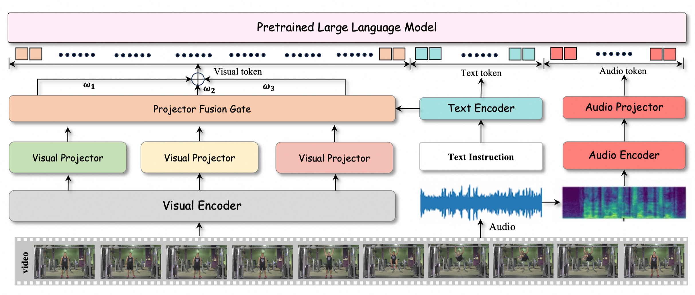
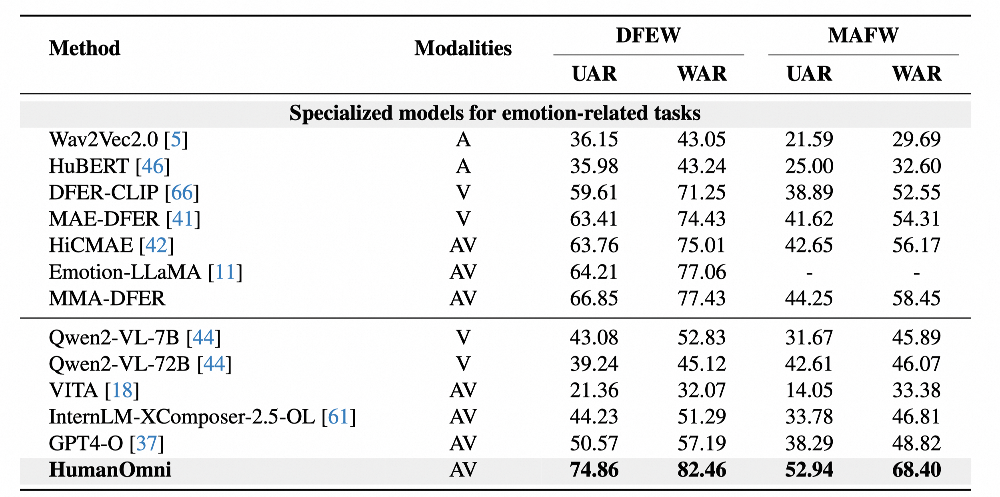
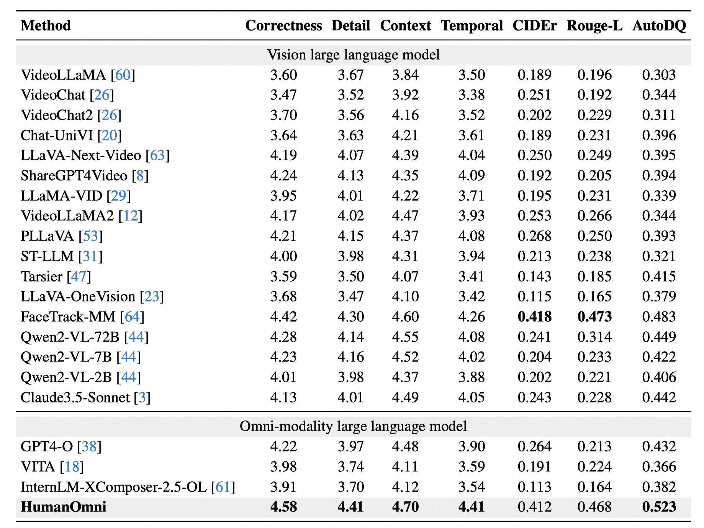
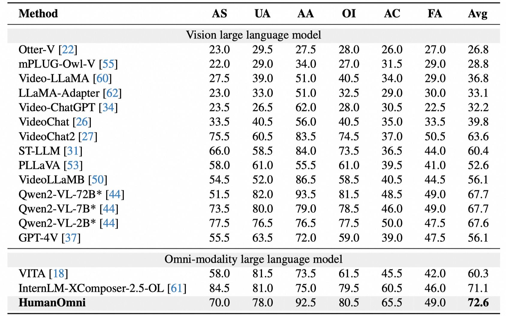

# HumanOmni: Human-Centric Omnimodal Large Language Model

  

## Introduction
**HumanOmni** is the industry's first human-centric omnimultimodal large language model designed to achieve comprehensive understanding in human-centric scenes.
1) **Domain-specific capability**: Trained on 2.4M human-centric video clips with 14M instructions
2) **Adaptive fusion**: Features three specialized branches with instruction-guided dynamic fusion
3) **Audio-visual synergy**: Integrates environmental audio cues with visual understanding
   
## Model Downloads

| **Model** | **#Total Params** | **Download** |
| :------------: | :------------: | :------------: |
| HumanOmni | 7B | [🤗 HuggingFace](https://huggingface.co/StarJiaxing/HumanOmni-7B)   |

### Upcoming Releases
+ 2B-Lite 
+ 72B-Expert 

## Performance
Here are some performance benchmarks of HumanOmni across various tasks:

  <figure>
    
    <figcaption>Fig 1: Performance on the emotion understanding task.</figcaption>
  </figure>
  <figure>
    
    <figcaption>Fig 2: Performance on the dynamic facial expression caption task.</figcaption>
  </figure>
  <figure>
    
    <figcaption>Fig 3: Performance on the action and pose understanding task.</figcaption>
  </figure>

## Environment Setup

To set up the recommended environment for HumanOmni, follow these instructions:

### Recommended Environment
- **Python**: >=3.10
- **CUDA**: >=12.1
- **PyTorch**: >=2.2 (with CUDA support)
- **Transformers**: >=4.45
- **Accelerate**: >=0.30.1
